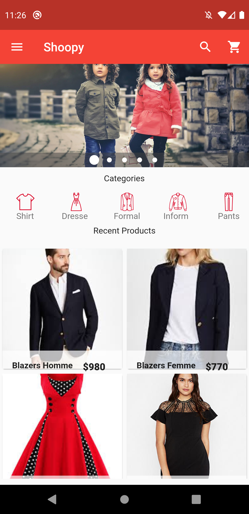
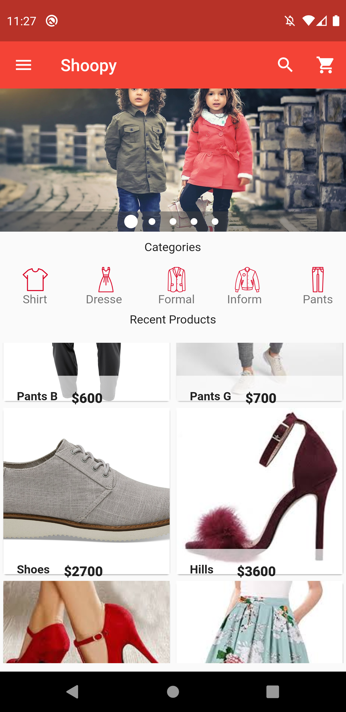
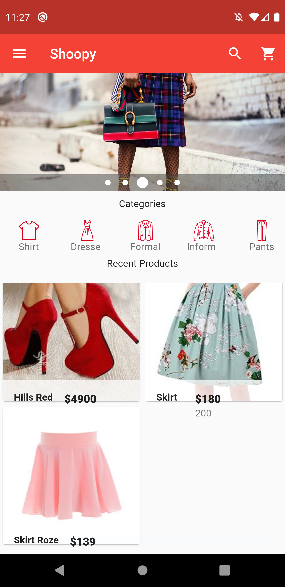
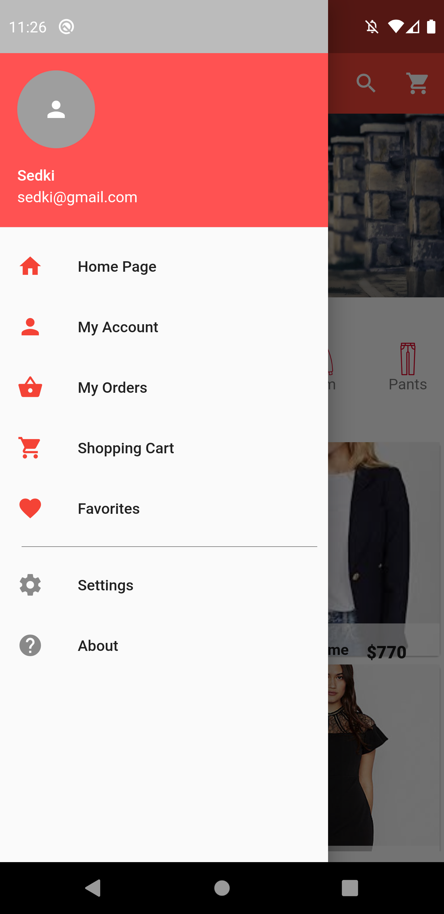
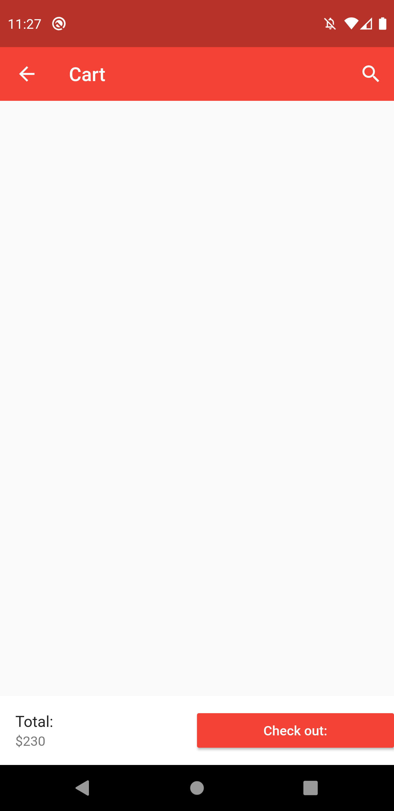
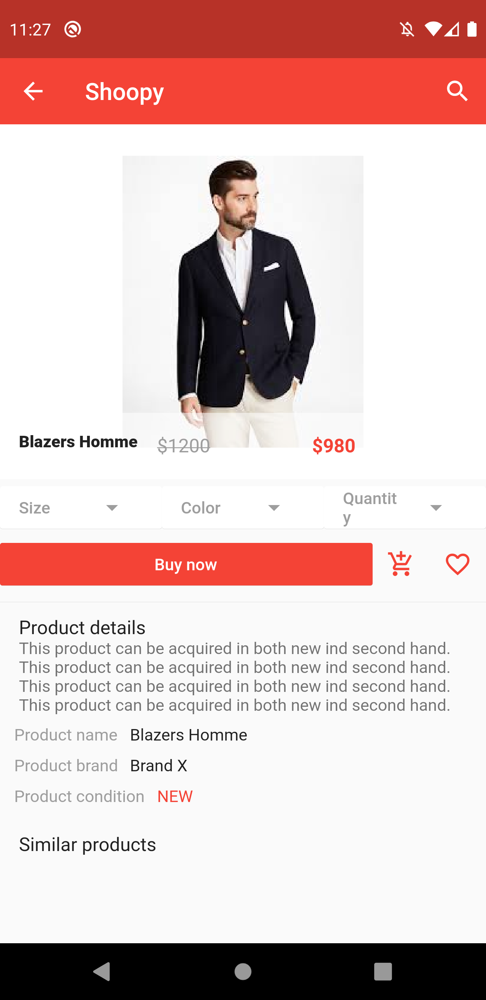
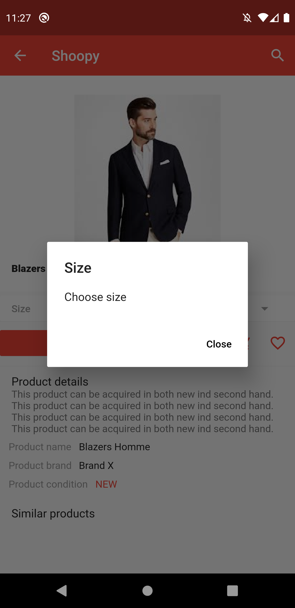

# shoopy - Flutter_Shopping_App

A new Flutter application.

## Getting Started

This project is a starting point for a Flutter application.

A few resources to get you started if this is your first Flutter project:

- [Lab: Write your first Flutter app](https://flutter.dev/docs/get-started/codelab)
- [Cookbook: Useful Flutter samples](https://flutter.dev/docs/cookbook)

For help getting started with Flutter, view our
[online documentation](https://flutter.dev/docs), which offers tutorials,
samples, guidance on mobile development, and a full API reference.

## Description

Shoopy app is a shopping app demo, written with flutter for iOS and Android using Bloc Pattern.

Show carousel of images product, Drawer,categories of several shops.
You can view products and navigate to details to add it to the cart list or buy it.

## Screen

<table>
    <tr>
        <td style="padding:5px">
            
        </td>
        <td style="padding:5px">
            
        </td>
        <td style="padding:5px">
            
        </td>
    </tr>
</table>

<table>
    <tr>
        <td style="padding:5px">
            
        </td>
        <td style="padding:5px">
            
        </td>
    </tr>
</table>
